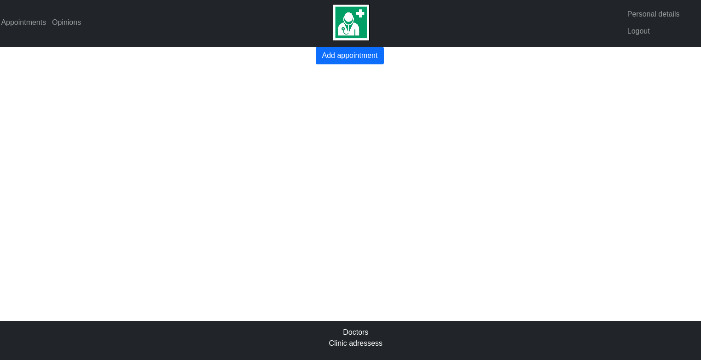
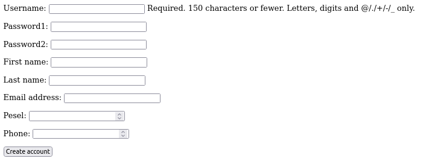
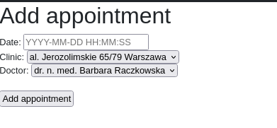

# Docplanner

# Table of Contents
* [General info](#general-info)
* [Technologies](#technologies)
* [Scope of functionalities](#scope-of-functionalities)
* [Illustrations](#illustrations)
* [Set up](#setup)
* [Project status](#project-status)

## General info
Booking platform provided for patients. The application is available only for logged on users.
Tests have been provided.

## Technologies
Project is created with:
* Python: 3.8.10

## Scope of functionalities
* create new patient profile
* log on (and log out) the booking platform (only logged on patients have access)
* patient can add appointment
* view all scheduled appointments of logged patient
* personal details can be viewed and updated
* patient can add an opinion about a specific doctor
* all available doctors are listed
* all available clinic locations are listed

## Illustrations
* main page:

* create new patient profile:

* log on:

* add appointment:

* personal details:

## Setup
To run this project, install it locally using pip:

$ cd ../your-dir
$ pip install Django == 3.8.10

And you're good to go!

## Project status
In progress